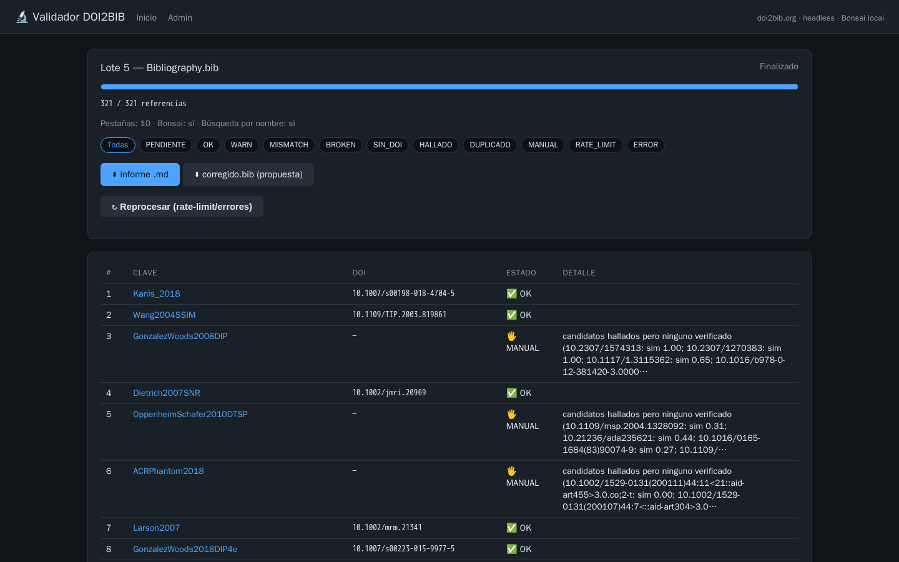
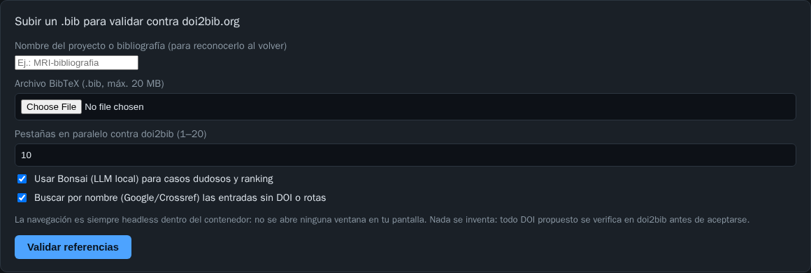
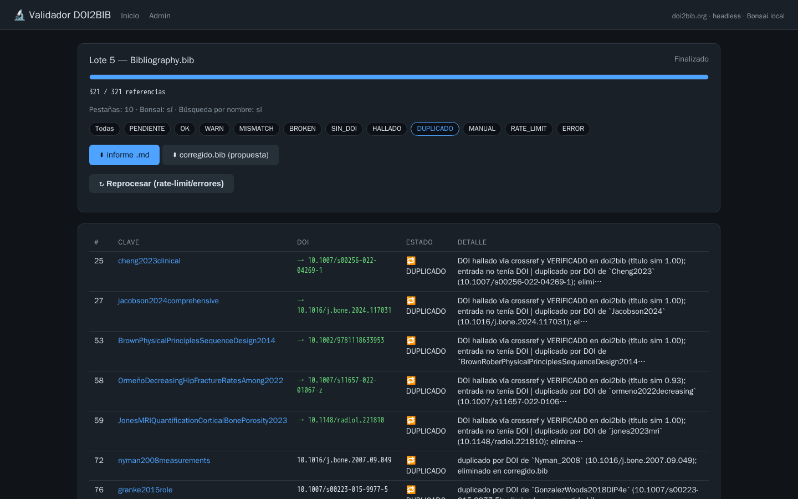
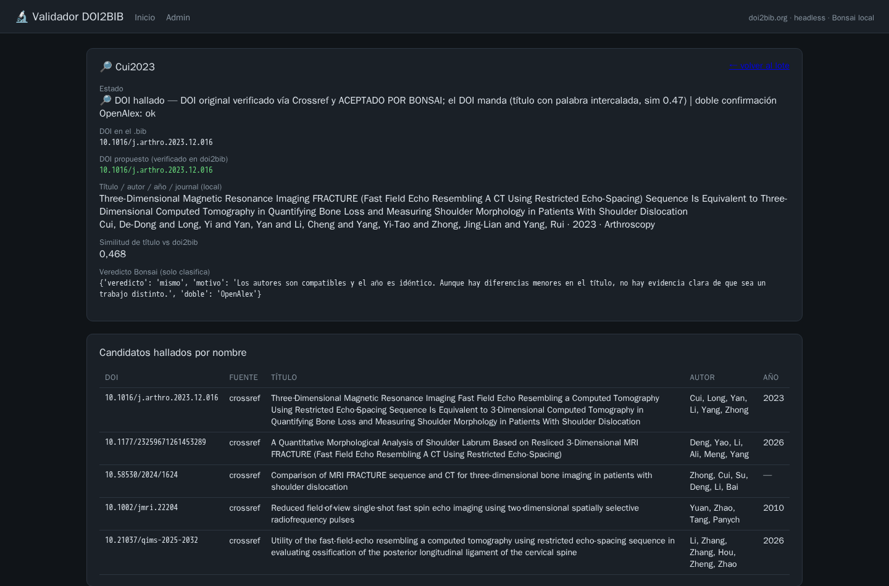

# Validador DOI2BIB


Valida, **repara y deduplica** las referencias de un archivo `.bib` contra
[doi2bib.org](https://www.doi2bib.org) y el registro oficial de Crossref,
con un **LLM local** (Bonsai 8B) que adjudica los casos sin coincidencia
exacta. Todo corre en Docker, en tu máquina: **nada se inventa y nada sale
de tu red** salvo las consultas bibliográficas.



## ¿Qué hace?

1. **Verifica cada DOI** en doi2bib.org con 10 pestañas headless en
   paralelo (Playwright). Si doi2bib no sirve un DOI, consulta el
   **registro oficial de Crossref** y, como última instancia, abre **la
   página real del artículo** vía doi.org para leer sus metadatos.
2. **Compara** título, autores, año, journal, volumen y páginas con un
   comparador tolerante (acentos LaTeX, subtítulos, año print-vs-online,
   sufijos Jr/III, guiones unicode).
3. **Bonsai (LLM local) adjudica** lo que no coincide exacto pero está
   cerca: mismo trabajo con cambios menores → se acepta y se repara.
   Nunca genera datos: todo DOI aceptado resolvió antes en una fuente de
   autoridad.
4. **Repara** el año, journal, volumen, páginas, autores, DOI **y la
   clave** en `corregido.bib` usando doi2bib/Crossref como autoridad
   ("si hay dudas, manda doi.org"). La entrada reparada adopta la clave
   de doi2bib (p. ej. `Chang2015UTE` → `Chang2014`): una clave cambiada
   te avisa que la entrada fue reescrita y hay que actualizar tu
   `\cite` en el paper — el informe lista todos los cambios de clave.
   El `.bib` original **nunca** se modifica.
5. **Deduplica por DOI** (el único identificador único válido) y
   desambigua claves repetidas (`Li_2014` → `Li_2014b`).
6. Busca **por nombre** (Google → DuckDuckGo → Bing + Crossref) el DOI de
   las entradas sin DOI o con DOI roto, y lo verifica antes de proponerlo.

## Instalación (todo en uno)

### Opción recomendada: un solo comando

Necesitas [Docker Desktop](https://www.docker.com/products/docker-desktop/)
y Python 3. Luego:

```bash
git clone https://github.com/cenarius1985/validacion-doi2bib.git
cd validacion-doi2bib
python coordinador.py
```

El coordinador construye y levanta todo el stack (web + LLM Bonsai),
**espera a que la app esté lista, abre tu navegador** y reporta cuando el
modelo del LLM terminó de cargar. La próxima vez es instantáneo:

```bash
python coordinador.py            # levantar y abrir el navegador
python coordinador.py --detener  # detener (datos y modelo persisten)
python coordinador.py --puerto 9090    # otro puerto si el 8090 está ocupado
python coordinador.py --no-navegador   # sin abrir el navegador
```

### Opción manual: solo Docker

```bash
git clone https://github.com/cenarius1985/validacion-doi2bib.git
cd validacion-doi2bib
docker compose up -d --build
# abre http://localhost:8090
```

En ambos casos el stack **incluye el LLM Bonsai** como otro servicio. En el
primer arranque se descarga el modelo desde HuggingFace una única vez
(`Ternary-Bonsai-8B-PQ2_0.gguf`, ~2 GB, queda persistido en el volumen
`bonsai_models`). La inferencia es CPU: no hace falta GPU.

- Web: <http://localhost:8090> · Bonsai interno (debug): <http://localhost:4688>
- Puerto ocupado: `WEB_PORT=9090 docker compose up -d --build`

### ¿HuggingFace bloqueado en tu red?

```bash
# Opción A: carpeta local con el GGUF (pendrive/mirror corporativo)
mkdir models && cp /ruta/a/Ternary-Bonsai-8B-PQ2_0.gguf models/
BONSAI_MODELS_BIND=./models docker compose up -d --build

# Opción B: copiarlo directo al volumen ya creado
docker cp Ternary-Bonsai-8B-PQ2_0.gguf validacion-doi2bib-bonsai-1:/models/
docker compose restart bonsai
```

Sin Bonsai el sistema funciona igual (los veredictos LLM quedan vacíos y
la validación sigue siendo determinista): el servicio puede caerse sin
afectar los resultados.

<details>
<summary><b>Variante: Bonsai externo (sin LLM en el stack)</b></summary>

La rama [`main-externo`](https://github.com/cenarius1985/validacion-doi2bib/tree/main-externo)
conserva la configuración original: el validador espera un Bonsai ya
corriendo en el host (puerto 4687, p. ej. del compose `ollamaLocal`) vía
`host.docker.internal`. Útil si ya tienes un LLM OpenAI-compatible y
prefieres no duplicar el modelo.

</details>

## Uso

Sube el `.bib` en el formulario, asígnale un **nombre de proyecto**
(p. ej. `MRI`, `US`, `paper-x`) para reconocerlo al volver, y sigue el
progreso en vivo. La lista de lotes de la portada tiene **paginador** y
**eliminación** (🗑️, con confirmación; bloqueado mientras el lote corre).
Al terminar:

- **Tabla con estados** filtrable por chip (abajo), con el detalle de cada
  verificación.
- **`informe .md`**: informe descargable con todas las decisiones, los DOI
  propuestos, lo aceptado por Bonsai y los duplicados eliminados.
- **`corregido.bib`**: la propuesta reparada y deduplicada; tu original no
  se toca.





También hay un modo CLI (sin UI):

```bash
docker compose exec web python manage.py validar --bib /app/sample/muestra.bib
docker compose exec web python manage.py validar --lote 1 --reprocesar
```

## ¿Cómo funciona?

```
                    ┌──────────────────────────────────────────┐
   .bib subido ────►│  web (Django)                            │
                    │  1. parsea entradas + dedupe temprano    │
                    │  2. FASE A: refs con DOI                 │
                    │       doi2bib ─► Crossref ─► doi.org     │
                    │  3. FASE B: sin DOI / roto / MISMATCH    │
                    │       Google/DDG/Bing + Crossref         │
                    │  4. comparador determinista (bib.py)     │
                    │       exacto ────────────► acepta        │
                    │       cercano ─► Bonsai adjudica         │
                    │  5. dedupe por DOI + informe + corregido │
                    └───────────────┬──────────────────────────┘
                                    │ red interna de compose
                             ┌──────▼──────┐
                             │ bonsai      │  fork PrismML de
                             │ llama.cpp   │  llama.cpp (GGUF
                             │ CPU, 8B     │  ternario, 2 GB)
                             └─────────────┘
```

- **La puerta de aceptación es determinista**: título ≥0.90 + autores
  coincidentes + año igual (±1 cuenta como edición online vs impresa).
- **Bonsai solo clasifica** los casos "cercanos" (título ≥0.60 con
  palabras compartidas, autores compatibles, año ±1) usando evidencia
  pre-calculada (apellidos en común, diferencia de años, solapamiento de
  palabras). Su veredicto acepta o rechaza; **jamás crea un DOI**.
- **Cascada de autoridad**: doi2bib.org → `api.crossref.org/works/<doi>`
  → página real del artículo (meta tags `citation_*` con Playwright; los
  challenges tipo Cloudflare se detectan y descartan).
- **Anti-invención**: ningún DOI entra al `corregido.bib` sin haberse
  resuelto antes en una de esas fuentes.

📚 **Runbook completo** — flujos de decisión, política de reintentos y
eliminación, riesgos residuales evaluados y plan de mejora por fases:
[`docs/RUNBOOK-VALIDACION.md`](docs/RUNBOOK-VALIDACION.md).
- **Manda el nombre, y lo no verificable se elimina**: si el título no
  coincide con lo que trae el DOI, el DOI está mal — se re-busca en la web
  por el NOMBRE, se verifica el DOI real en doi2bib/Crossref y se conserva
  lo que traiga ese DOI correcto. Si aun así no hay coincidencia
  verificable, la referencia se considera inválida (probable alucinación de
  un asistente de escritura) y **sale de `corregido.bib`** (🗑️ ELIMINAR);
  el informe la lista para revisión.

### Estados por referencia

| Estado | Significado |
|---|---|
| ✅ OK | resolvió y todo coincide |
| ⚠️ WARN | verificado con diferencias menores (ya reparadas en `corregido.bib`) |
| ❌ MISMATCH | contradice a la autoridad y no se pudo aceptar |
| ⛔ BROKEN | el DOI no resuelve en ninguna fuente |
| ➖ SIN_DOI | la entrada no trae DOI |
| 🔎 HALLADO | DOI hallado por nombre y verificado |
| 🔁 DUPLICADO | mismo DOI que otra entrada; eliminado de `corregido.bib` |
| 🗑️ ELIMINAR | sin ninguna coincidencia verificable por nombre: probable alucinación; eliminada de `corregido.bib` |
| 🖐️ MANUAL | con candidatos pero ninguno verificado (revisar a mano) |
| ⏳ RATE_LIMIT | doi2bib cortó el ritmo; botón *Reprocesar* más tarde |
| ❓ ERROR | fallo técnico (reintentar) |

## Configuración (`.env.example`)

| Variable | Default | Descripción |
|---|---|---|
| `WEB_PORT` | `8090` | Puerto del host para la web |
| `BONSAI_BASE_URL` | `http://bonsai:8080/v1` | Endpoint del LLM (interno) |
| `BONSAI_MODEL` | `ternary-bonsai-8b` | Alias del modelo servido |
| `BONSAI_GGUF` / `BONSAI_HF_REPO` | ver `.env.example` | Modelo y repo de HuggingFace |
| `BONSAI_MODELS_BIND` | *(volumen)* | Carpeta local con el GGUF si HF está bloqueado |
| `BONSAI_HOST_PORT` | `4688` | Puerto del host para debug del Bonsai |
| `BONSAI_CONCURRENCIA` | `4` | Llamadas simultáneas al LLM |
| `DOI2BIB_TABS` | `10` | Pestañas headless en paralelo |
| `DOI2BIB_MIN_INTERVALO` | `1.0` s | Cortesía global entre consultas |
| `DOI2BIB_PAUSA_RATE_LIMIT` | `60` s | Pausa ante "Too many requests" |
| `BUSCADOR_TABS` / `BUSCADOR_DELAY` | `2` / `2.5` s | Búsqueda por nombre |
| `CANDIDATOS_A_VERIFICAR` | `4` | Candidatos verificados por entrada |

## Solución de problemas

- **El modelo tarda en estar listo**: el contenedor `bonsai` queda
  `health: starting` mientras carga el GGUF a RAM (1-2 min en CPU). La web
  funciona desde ya con validación determinista.
- **Muchos RATE_LIMIT**: baja `DOI2BIB_TABS` o sube `DOI2BIB_MIN_INTERVALO`;
  luego pulsa *Reprocesar* (reintenta solo lo pendiente, reutilizando los
  candidatos ya hallados).
- **Red corporativa sin acceso a Google**: la búsqueda por nombre cae a
  DuckDuckGo y Bing; Crossref siempre está disponible (API pública).
- **Docker en otra arquitectura** (Apple Silicon): el validador es
  multi-arquitectura; el binario del Bonsai es x64 (emula bajo Rosetta/QEMU
  o compila el fork PrismML para arm64).

## Notas de seguridad

Este proyecto está pensado para **uso local** (Docker en tu máquina). La
configuracion por defecto incluye `DEBUG=1` y `ALLOWED_HOSTS=["*"]` por
comodidad: **no lo expongas a internet** sin endurecerlo
(`DJANGO_DEBUG=0`, un `DJANGO_SECRET_KEY` propio y un reverse proxy con
auth). No hay telemetría, cuentas ni claves de API: `.env.example` solo
trae configuración de arranque.

## Licencia

[MIT](LICENSE) © Fernando José Ramírez Sarmiento
